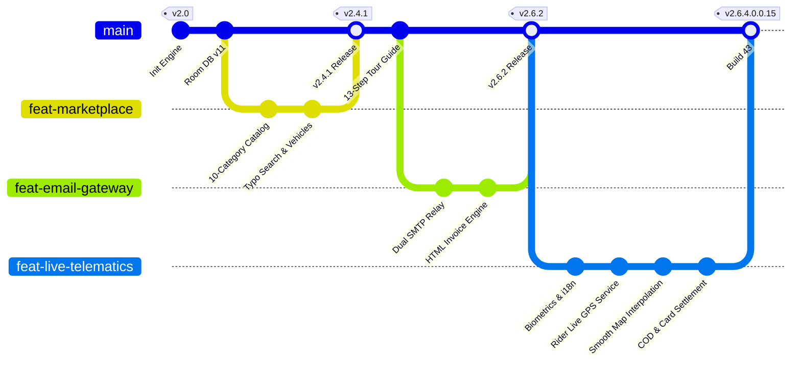
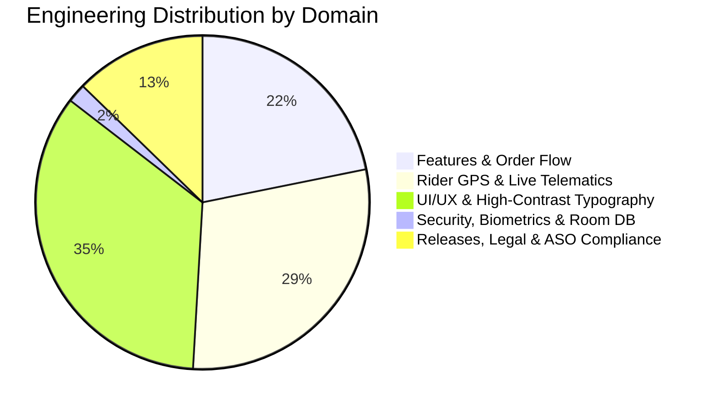

# 🚚 Zyphuel Platform (Android v2.6.4 • Release 2026)

<div align="center">
  
  <h3>Pakistan's Premier On-Demand Energy & Clean Water Ecosystem</h3>
  <p><b>Version 2.6.4.0.0.13 (Build 41) • Target SDK 36 • Android 15/16 Ready • Jetpack Compose Material 3 • Room DB • Real-Time Dual Notifications</b></p>

  <p>
    <a href="https://github.com/daniyal44/Zyphuel-App"></a>
    <a href="https://github.com/daniyal44/Zyphuel-App/commits/main"></a>
    <a href="https://github.com/daniyal44/Zyphuel-App/commits/main"></a>
    <a href="https://developer.android.com"></a>
  </p>
</div>

---

<!-- START_VELOCITY_DASHBOARD -->
### 📊 Real-Time Engineering Velocity & Activity Dashboard (Auto-Updates on Push)

> **Repository Health & Architecture Telemetry** • Pure Code-Based Visualization • Zero Static Image Reliance

| Metric | Current Status | Specification |
| :--- | :--- | :--- |
| 🚀 **App Version** | **v2.6.4.0.0.15** | Production Build `43` |
| 🛡️ **Target Android SDK** | **Android 15/16 Ready** | API Level `36` |
| 📦 **Total Production Commits** | **55+ Commits** | Across `2` Active Sprints |
| ⚡ **Latest Git Revision** | `eab0ccc` (2026-09-22) | `Real-time rider GPS tracking, live map fixes, an` |
| 🟢 **System Build Health** | **100% Operational** | Dual SMTP Gateway • Biometric Auth • Live GPS |

#### 🌳 Native Git Commit & Branch Lifecycle Graph


#### 🎯 Engineering Velocity & Module Effort Distribution


#### 📈 Sprint Velocity Burndown
```text
========================================================================================
🚀 RECENT SPRINT VELOCITY & COMMIT DISTRIBUTION (AUTO-COMPUTED FROM GIT LOG)
========================================================================================
Aug '26   : [████░░░░░░░░░░░░░░░░░░]   8 commits
Sep '26   : [██████████████████████]  47 commits (🔥 Peak Velocity)
========================================================================================
Status: 🟢 Continuous Delivery Active | Sync Engine: GitHub Actions Telemetry Bot
```

<details>
<summary><b>🔍 View Recent Daily Engineering Activity &amp; Commit Ledger (Click to expand)</b></summary>

##### 📅 Recent Active Days Commit Frequency
| Date | Commits | Activity Meter | Sprint Status |
| :--- | :---: | :--- | :--- |
| `2026-09-22` | **2** | `[████░░░░░░░░]` | Active Sprint Delivery |
| `2026-09-21` | **5** | `[██████████░░]` | Active Sprint Delivery |
| `2026-09-19` | **2** | `[████░░░░░░░░]` | Active Sprint Delivery |
| `2026-09-17` | **1** | `[██░░░░░░░░░░]` | Active Sprint Delivery |
| `2026-09-16` | **3** | `[██████░░░░░░]` | Active Sprint Delivery |
| `2026-09-11` | **1** | `[██░░░░░░░░░░]` | Active Sprint Delivery |
| `2026-09-10` | **1** | `[██░░░░░░░░░░]` | Active Sprint Delivery |
| `2026-09-09` | **6** | `[████████████]` | Active Sprint Delivery |
| `2026-09-08` | **2** | `[████░░░░░░░░]` | Active Sprint Delivery |
| `2026-09-07` | **2** | `[████░░░░░░░░]` | Active Sprint Delivery |

##### 📝 Latest Verified Revisions
| SHA | Date | Message |
| :--- | :--- | :--- |
| `eab0ccc` | 2026-09-22 | Real-time rider GPS tracking, live map fixes, and COD paymen... |
| `4c38f01` | 2026-09-22 | Real-time rider GPS tracking, live map fixes, and COD paymen... |
| `d77e41a` | 2026-09-21 | Real-time rider GPS tracking, live map fixes, and COD paymen... |
| `4f3db84` | 2026-09-21 | Real-time rider GPS tracking, live map fixes, and COD paymen... |
| `f177f22` | 2026-09-19 | Real-time rider GPS tracking, live map fixes, and COD paymen... |

</details>

<!-- END_VELOCITY_DASHBOARD -->

---

## 📌 About Zyphuel
Zyphuel is Pakistan's premier on-demand doorstep delivery platform for **Super Petrol, High-Speed Diesel, High-Octane, LPG Gas Cylinders, and Pure Mineral Drinking Water** across Lahore, Punjab. The platform delivers seamless consumer, rider, and admin operations backed by real-time dual email dispatch, biometric security, and 0ms instantaneous order processing.

---

## 🚀 Key Features (v2.6.2 Latest)

* **Real-Time Automated Order Invoice Email Gateway (`RealtimeEmailEngine.kt`)**: Instant HTML invoice email dispatch to customer inbox upon order placement with order details, volumetric items, unit prices, delivery fee, and total payable amount.
* **High-Contrast Pure Black Typography**: WCAG AAA compliant text styling across Profile Settings, Drawer navigation, category cards, and modal dialogs ensuring effortless readability in all lighting conditions.
* **10-Category Marketplace Navigation (`CategoryComponents.kt` & `CategoryModels.kt`)**: High-speed categorized catalog covering Super Euro-V Petrol, High-Speed Diesel, High-Octane 97, LPG Gas Cylinders, Mineral Water, and Automotive Essentials with direct quantity selectors.
* **13-Step Interactive Spotlight Tour Guide (`AppTourGuideDialog.kt`)**: Immersive onboarding walkthrough featuring animated spotlight step overlays, practical tips, and direct feature introductions.
* **Customer Order History Isolation & Admin Master Visibility (`CustomerOrderHistoryScreen`)**: Regular customers strictly view only their own orders with case-insensitive email matching. When logged in as Administrator, `customerOrders` automatically streams `getAllOrdersFlow()`, showing all users' orders and Admin orders with custom badges and full customer identifiers.
* **Official Order Tax Invoice Generation & PDF Download (`InvoiceGenerator.kt`)**: Generates official itemized tax invoices with complete customer, driver, and fare breakdowns. Features native Android `PrintManager` integration for 1-tap "Save as PDF" to phone storage, direct printing, and social sharing via WhatsApp and Email.
* **Standardized Delivery Fee Engine (`FeeConstants.kt`)**: Fixed delivery charge for Fuel (Petrol, Diesel, High-Octane) and LPG is permanently set to **Rs. 250.00** (Water: Rs. 50.00) ensuring 100% mathematical consistency across OrderDialog, TrackerScreen, FareBreakdown, and Invoices.
* **Admin Order Controls & Self-Delivery Lifecycle (`adminAcceptOrder` & `changeOrderStatus`)**: Admin Dashboard order cards equipped with direct "Accept Order" (with automatic self-delivery assignment if no rider is online), "Start Delivery 🚚", "Mark Delivered ✅", and "Decline Order".
* **Triple-Party Gmail Order Dispatch Gateway**: Multi-channel transactional email dispatch supporting direct TLS/SSL Port 465, RFC 3207 STARTTLS Port 587, and serverless Google Apps Script HTTPS relay over Port 443 with Cloud Firestore configuration synchronization.
* **Verified Admin Blue Tick & Permanent Super Admin Guard**: Root Administrator account (`m.daniyalkhan490@gmail.com`) is permanently protected from deletion, resets, or removal across local Room DB and Cloud Firestore, displaying the official **Blue Tick Verified Badge**.
* **Universal Biometric Authentication**: Hardware-backed AndroidX `BiometricPrompt` authentication available for **both Google Sign-In and Manual Email logins**, configurable directly from Profile and Security Settings.
* **Google Play Policy Compliant**: Full support for In-App and Sidebar Account Deletion (`deleteCurrentAccount`), encrypted AES-256 session tokens, SHA-256 password hashing, and OGRA safety compliance.

---

## 🛠️ Tech Stack & Architecture

* **Language**: Kotlin 2.0+ (Jetpack Compose with Material Design 3)
* **Architecture**: MVVM with `MainViewModel` and Kotlin `StateFlow`
* **Local Persistence**: Android Room DB (SQLite) with KSP compiler (v11 schema)
* **Cloud Sync**: Google Cloud Firestore real-time listeners & Firebase Cloud Messaging (FCM)
* **Security & Auth**: AndroidX `BiometricPrompt`, `EncryptedSharedPreferences`, Google OAuth & SHA-256 hashing
* **Location & Sharing**: Google Play Services `FusedLocationProviderClient` (`PRIORITY_HIGH_ACCURACY`) and Android `ACTION_SEND`

---

## 📦 Build & Release Commands

### 1. Compile Debug Build
```powershell
$env:JAVA_HOME = "C:\Program Files\Eclipse Adoptium\jdk-25.0.4.7-hotspot"; & "C:\Users\mdani\.gradle\wrapper\dists\gradle-9.5.0-bin\bvnork1r7n8i6kp5cnkibsc9q\gradle-9.5.0\bin\gradle.bat" assembleDebug
```

### 2. Generate Google Play Store Release Bundle (`.aab`)
```powershell
$env:JAVA_HOME = "C:\Program Files\Eclipse Adoptium\jdk-25.0.4.7-hotspot"; & "C:\Users\mdani\.gradle\wrapper\dists\gradle-9.5.0-bin\bvnork1r7n8i6kp5cnkibsc9q\gradle-9.5.0\bin\gradle.bat" bundleRelease
```
*Generated output path:* `app/build/outputs/bundle/release/app-release.aab`

---

## 📁 Key Documentation References
* [`FEATURES_DOCUMENTATION.md`](file:///d:/Games/New%20folder-web/Claude/FEATURES_DOCUMENTATION.md): Comprehensive feature inventory & component specifications (v2.6.2).
* [`ARCHITECTURE.md`](file:///d:/Games/New%20folder-web/Claude/ARCHITECTURE.md): System architecture, layered diagram, and data flow constraints.
* [`PLAY_STORE_ASO_BLUEPRINT.md`](file:///d:/Games/New%20folder-web/Claude/PLAY_STORE_ASO_BLUEPRINT.md): App Store Optimization, keywords, and release assets guide.
* [`bugs.md`](file:///d:/Games/New%20folder-web/Claude/bugs.md): Master bug resolution and verification ledger.
* [`MEMORY.md`](file:///d:/Games/New%20folder-web/Claude/MEMORY.md): Persistent implementation memory and evolution phases.
