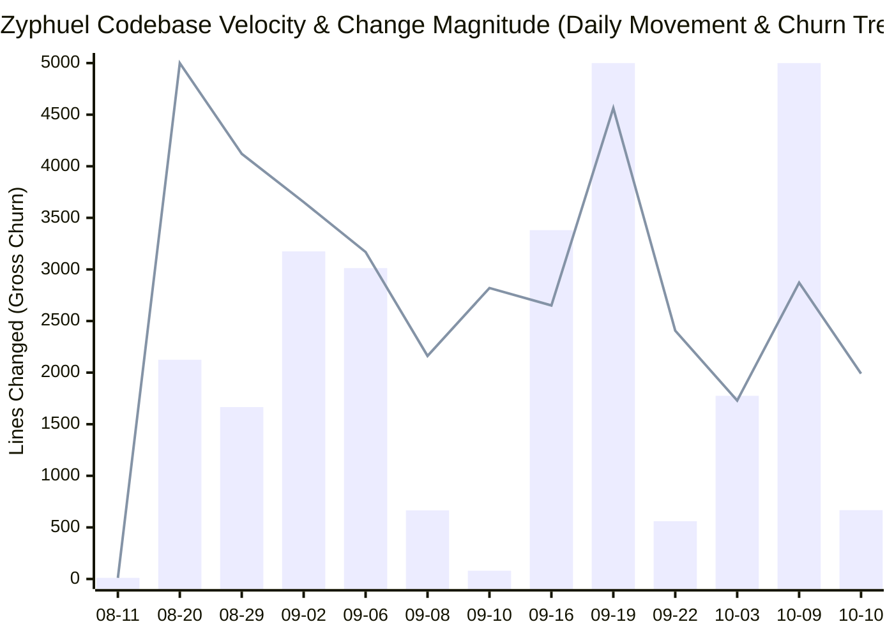
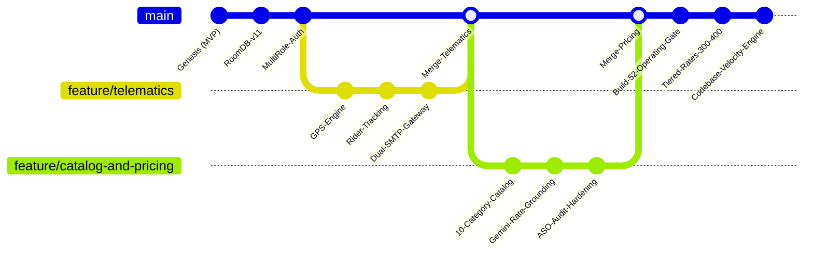

# 🚚 Zyphuel Platform (Android v2.6.4 • Release 2026)

<div align="center">
  
  <h3>Pakistan's Premier On-Demand Fuel & Clean Energy Ecosystem</h3>
  <p><b>Version 2.6.4.0.0.24 (Build 52) • Target SDK 36 • Android 15/16 Ready • Jetpack Compose Material 3 • Room DB • Real-Time Dual Notifications</b></p>

  <p>
    <a href="https://github.com/daniyal44/Zyphuel-App"></a>
    <a href="https://github.com/daniyal44/Zyphuel-App/commits/main"></a>
    <a href="https://github.com/daniyal44/Zyphuel-App/commits/main"></a>
    <a href="https://developer.android.com"></a>
  </p>
</div>

---

<!-- START_VELOCITY_DASHBOARD -->
### 📈 Real-Time Trading-Style Codebase Velocity & Movement Engine

> **Architecture:** Pure Code-Based Dynamic Visualization (Zero Static SVG Files)  
> **Engine Scope:** Multi-timeframe tracking across **Daily (1D)**, **Weekly (1W)**, and **Monthly (1M)** buckets.  
> **Code Magnitude Evaluation:** Dynamically analyzes git code churn, line additions/deletions, files changed, and categorizes every update as a **Major Shift**, **Moderate Shift**, or **Minor Shift**.  
> **Last Synchronized:** <font color="#10b981"><b>2026-10-10</b></font> • **App Version:** <font color="#10b981"><b>v2.6.4.0.0.26 (Build 54)</b></font>

```text
=================================================================================================================ZYPHUEL REAL-TIME TRADING-STYLE CODEBASE VELOCITY & MOVEMENT TERMINAL
Engine: Dynamic Code Churn • Push Cadence Intervals • Scale of Change Classification (Major vs. Minor Shifts)
=================================================================================================================APP VERSION: v2.6.4.0.0.26 (Build 54)   | TOTAL COMMITS: 84   | ACTIVE CODING DAYS: 24
CODE CHURN : +72,917 / -16,718 lines  | GROSS IMPACT : 89,635 lines | MAJOR SHIFTS: 43 (51%)
PUSH CADENCE: Avg ~19.9h per push     | FASTEST INTERVAL: 0m      | MAX COOLDOWN: 8.9d
MOMENTUM   : ▲ BULLISH ACCELERATION     | OPERATING GATE: Mon-Thu 8am-8pm, Fri 8am-1pm, Sat-Sun 10am-6pm PKT
------------------------------------------------------------------------------------------------------------------------
SHA      DATE & TIME       INTERVAL  CHURN METER  SCALE OF CHANGE CHURN (+/-)    MOMENTUM TREND    COMMIT SUMMARY
------------------------------------------------------------------------------------------------------------------------
ae5288c  2026-10-10 15:26  +14.9h    ██████░░░░   MODERATE SHIFT  +120/-9        ▲ ACCUMULATION    feat: add desktop emulator runner script
2d8560b  2026-10-10 00:31  +24m      ██████████   MAJOR SHIFT     +157/-60       ▲ BULLISH SURGE   security(credentials): decouple admin pa
1abfd9e  2026-10-10 00:07  +1m       ███░░░░░░░   MINOR SHIFT     +18/-18        ◄ CONSOLIDATION   chore(sync): verify conflict-free push &
8c608ff  2026-10-10 00:07  +31m      ██████████   MAJOR SHIFT     +213/-72       ▲ BULLISH SURGE   chore(release): bump app to v2.6.4.0.0.2
f93d03f  2026-10-09 23:35  +14m      ██████████   MAJOR SHIFT     +598/-806      ▲ BULLISH SURGE   docs: transition to 100% code-based dyna
cd9a79b  2026-10-09 18:22  +0m       ███░░░░░░░   MINOR SHIFT     +2/-2          ◄ CONSOLIDATION   chore(dashboard): auto-update code-based
4c46dc4  2026-10-09 23:21  +37m      ██████████   MAJOR SHIFT     +1711/-914     ▲ BULLISH SURGE   docs: synchronize all markdown files wit
36d05a4  2026-10-09 22:45  +3m       ██████████   MAJOR SHIFT     +0/-0          ◄ CONSOLIDATION   chore(dashboard): sync code-based veloci
4524b79  2026-10-09 22:42  +1m       ██████████   MAJOR SHIFT     +13/-13        ◄ CONSOLIDATION   chore(dashboard): sync code-based veloci
59e9fae  2026-10-09 22:41  +1m       ██████████   MAJOR SHIFT     +885/-244      ▲ BULLISH SURGE   feat(release): bump to v2.6.4.0.0.24 (Bu
=================================================================================================================```

#### 📊 Dynamic Codebase Churn & Velocity Chart (Mermaid Vector Rendering)

```mermaid
xychart-beta
    title "Zyphuel Codebase Velocity & Change Magnitude (Daily Movement & Churn Trend)"
    x-axis ["08-11", "08-20", "08-29", "09-02", "09-06", "09-08", "09-10", "09-16", "09-19", "09-22", "10-03", "10-09", "10-10"]
    y-axis "Lines Changed (Gross Churn)" 0 --> 5000
    bar [11, 2125, 1666, 3175, 3013, 665, 80, 3381, 5000, 560, 1775, 5000, 667]
    line [11, 5000, 4121, 3653, 3169, 2162, 2820, 2651, 4564, 2407, 1729, 2872, 1990]
```

#### 🌿 Architectural Milestone Progression

```mermaid
gitGraph
    commit id: "Genesis (MVP)"
    commit id: "RoomDB-v11"
    commit id: "MultiRole-Auth"
    branch feature/telematics
    checkout feature/telematics
    commit id: "GPS-Engine"
    commit id: "Rider-Tracking"
    commit id: "Dual-SMTP-Gateway"
    checkout main
    merge feature/telematics id: "Merge-Telematics"
    branch feature/catalog-and-pricing
    checkout feature/catalog-and-pricing
    commit id: "10-Category-Catalog"
    commit id: "Gemini-Rate-Grounding"
    commit id: "ASO-Audit-Hardening"
    checkout main
    merge feature/catalog-and-pricing id: "Merge-Pricing"
    commit id: "Build-52-Operating-Gate"
    commit id: "Tiered-Rates-300-400"
    commit id: "Codebase-Velocity-Engine"
```

#### 📋 Codebase Scale & Multi-Timeframe Velocity Metrics
| Metric | Current Status | Codebase Specification |
| :--- | :--- | :--- |
| 🚀 **App Version** | **v2.6.4.0.0.26** | Production Build `54` |
| 🛡️ **Target Android SDK** | **Android 15/16 Ready** | API Level `36` |
| 📦 **Total Lifetime Commits** | **84 Commits** | Inception (<font color="#10b981"><b>2026-08-11</b></font>) to Present (<font color="#10b981"><b>2026-10-10</b></font>) |
| 🔄 **Total Codebase Churn** | **+72,917 / -16,718** | Net Delta: `+56,199` lines across codebase |
| ⚖️ **Shift Magnitude Ratio** | **43 Major • 19 Moderate • 22 Minor** | `51%` Major Architectural Shifts |
| ⏱️ **Push Cadence & Intervals** | **~19.9h Active Cadence** | Min: `0m` • Max Cooldown: `8.9d` |
| 📈 **Movement Momentum** | **▲ BULLISH EXPANSION** | High-velocity momentum across sprints |
| 📅 **Total Active Coding Days** | **24 Days** | `3.5` Avg Commits / Active Day |
| ⚡ **Latest Verified Push** | `ae5288c` (<font color="#10b981"><b>2026-10-10</b></font> `15:26`) | `feat: add desktop emulator runner script and pre` |
| 🟢 **Operational Delivery Gate** | **Mon–Thu 8am–8pm, Fri 8am–1pm, Sat–Sun 10am–6pm PKT** | Tiered Rates (Rs. 300–400), 15L Cap, Silent +Rs. 5/L Markup |

<details>
<summary><b>🔍 View Detailed Codebase Shift Ledgers (1D Daily, 1W Weekly &amp; 1M Monthly) (Click to expand)</b></summary>

##### 🗓️ 1M Monthly Macro Volume & Sprint Milestones (Project Start to Present)
| Month | Commits | % Share | Churn (+/-) | Velocity Meter | Shift Classification | Sprint Focus & Core Milestones |
| :--- | :---: | :---: | :---: | :--- | :--- | :--- |
| <font color="#10b981"><b>August 2026</b></font> | `8` | **9.5%** | `+37,630 / -1,506` | `███████████░` | 4 Major / 1 Minor | 🚀 **Genesis & Architecture**: Core Android MVP, Multi-Role Auth (Customer/Rider/Admin), Room DB v11 & Initial Fuel Dispatch |
| <font color="#10b981"><b>September 2026</b></font> | `50` | **59.5%** | `+30,575 / -11,572` | `████████████` | 28 Major / 9 Minor | 🔥 **Marketplace & Telematics**: 10-Category Catalog, Live Rider GPS Telematics, Dual SMTP Email Gateway, PDF Invoices & Interactive Tour |
| <font color="#10b981"><b>October 2026</b></font> | `26` | **31.0%** | `+4,712 / -3,640` | `██░░░░░░░░░░` | 11 Major / 12 Minor | ⚡ **Security & Operating Gate**: Secret Hardening, Tiered Delivery Fees (300-400 PKR), Silent OGRA Markup, Operating Hours Gate & Code-Based Graph |

##### 📅 1W Weekly Velocity & Momentum Breakdown
| Week | Commits | Active Days | Churn (+/-) | Velocity Meter | Shift Breakdown | Momentum Trend |
| :--- | :---: | :---: | :---: | :--- | :--- | :--- |
| <font color="#10b981"><b>2026-W42</b></font> | `1` | `1 days` | `+120/-9` | `█░░░░░░░░░` | 0 Major, 0 Minor | **▲ ACTIVE EXPANSION** |
| <font color="#10b981"><b>2026-W41</b></font> | `25` | `4 days` | `+4592/-3631` | `██░░░░░░░░` | 11 Major, 12 Minor | **▲ ACTIVE EXPANSION** |
| <font color="#10b981"><b>2026-W40</b></font> | `2` | `1 days` | `+428/-210` | `█░░░░░░░░░` | 1 Major, 1 Minor | **▲ ACTIVE EXPANSION** |
| <font color="#10b981"><b>2026-W39</b></font> | `10` | `3 days` | `+9986/-1537` | `███░░░░░░░` | 4 Major, 4 Minor | **▲ ACTIVE EXPANSION** |
| <font color="#10b981"><b>2026-W38</b></font> | `4` | `2 days` | `+2910/-994` | `█░░░░░░░░░` | 2 Major, 0 Minor | **▲ ACTIVE EXPANSION** |
| <font color="#10b981"><b>2026-W37</b></font> | `14` | `6 days` | `+10462/-5997` | `████░░░░░░` | 11 Major, 2 Minor | **▲ ACTIVE EXPANSION** |

##### 📅 1D Daily Push Cadence & Incline/Decline Trends (Recent 12 Active Days)
| Date | Commits | Churn (+/-) | Velocity Meter | Shift Scale Breakdown | Timing of Pushes | Movement Trend |
| :--- | :---: | :---: | :--- | :--- | :--- | :--- |
| <font color="#10b981"><b>2026-10-10</b></font> | `4` | `+508/-159` | `█░░░░░░░░░` | 2 Major, 1 Mod, 1 Min | From `00:07` to `15:26` | **▼ CONSOLIDATION** |
| <font color="#10b981"><b>2026-10-09</b></font> | `7` | `+3211/-1981` | `█░░░░░░░░░` | 5 Major, 0 Mod, 2 Min | From `17:40` to `23:35` | **▲ BULLISH SURGE** |
| <font color="#10b981"><b>2026-10-04</b></font> | `10` | `+414/-304` | `█░░░░░░░░░` | 2 Major, 2 Mod, 6 Min | From `00:05` to `08:43` | **▼ CONSOLIDATION** |
| <font color="#10b981"><b>2026-10-03</b></font> | `5` | `+579/-1196` | `█░░░░░░░░░` | 2 Major, 0 Mod, 3 Min | From `22:59` to `19:07` | **◄ ACCUMULATION** |
| <font color="#10b981"><b>2026-09-30</b></font> | `2` | `+428/-210` | `█░░░░░░░░░` | 1 Major, 0 Mod, 1 Min | From `23:59` to `18:58` | **▼ CONSOLIDATION** |
| <font color="#10b981"><b>2026-09-22</b></font> | `2` | `+322/-238` | `█░░░░░░░░░` | 1 Major, 1 Mod, 0 Min | From `00:01` to `01:13` | **▼ CONSOLIDATION** |
| <font color="#10b981"><b>2026-09-21</b></font> | `6` | `+1049/-1203` | `█░░░░░░░░░` | 2 Major, 0 Mod, 4 Min | From `22:19` to `20:12` | **▼ CONSOLIDATION** |
| <font color="#10b981"><b>2026-09-19</b></font> | `2` | `+8615/-96` | `███░░░░░░░` | 1 Major, 1 Mod, 0 Min | From `23:31` to `18:30` | **▲ BULLISH SURGE** |
| <font color="#10b981"><b>2026-09-17</b></font> | `1` | `+153/-370` | `█░░░░░░░░░` | 1 Major, 0 Mod, 0 Min | At `01:26` | **▼ CONSOLIDATION** |
| <font color="#10b981"><b>2026-09-16</b></font> | `3` | `+2757/-624` | `█░░░░░░░░░` | 1 Major, 2 Mod, 0 Min | From `21:56` to `20:27` | **▲ BULLISH SURGE** |
| <font color="#10b981"><b>2026-09-11</b></font> | `1` | `+611/-568` | `█░░░░░░░░░` | 1 Major, 0 Mod, 0 Min | At `00:18` | **▼ CONSOLIDATION** |
| <font color="#10b981"><b>2026-09-10</b></font> | `1` | `+41/-39` | `█░░░░░░░░░` | 0 Major, 1 Mod, 0 Min | At `19:18` | **▼ CONSOLIDATION** |

</details>

<!-- END_VELOCITY_DASHBOARD -->

---

## 📌 About Zyphuel
Zyphuel is Pakistan's premier on-demand doorstep delivery platform for **Super Euro-V Petrol, High-Speed Diesel, and High-Octane 97** across Lahore, Punjab. The platform delivers seamless consumer, rider, and admin operations backed by real-time dual email dispatch, biometric security, and 0ms instantaneous order processing.

---

## 🚀 Key Features (v2.6.4.0.0.24 Latest)

* **Real-Time Automated Order Invoice Email Gateway (`RealtimeEmailEngine.kt`)**: Instant HTML invoice email dispatch to customer inbox upon order placement with order details, volumetric items, unit prices, delivery fee, and total payable amount.
* **High-Contrast Pure Black Typography**: WCAG AAA compliant text styling across Profile Settings, Drawer navigation, category cards, and modal dialogs ensuring effortless readability in all lighting conditions.
* **10-Category Marketplace Navigation (`CategoryComponents.kt` & `CategoryModels.kt`)**: High-speed categorized catalog covering Super Euro-V Petrol, High-Speed Diesel, High-Octane 97, and Automotive Essentials with direct quantity selectors (Doorstep fuel orders strictly capped at 15 Liters per OGRA safety rules; Water & LPG cylinders currently unavailable).
* **Delivery Operating Hours & Order Gate (`DeliveryOperatingHoursManager.kt`)**: Strictly enforces delivery windows (Mon–Thu 08:00 AM–08:00 PM, Fri 08:00 AM–01:00 PM, Sat–Sun 10:00 AM–06:00 PM PKT). Outside these hours, order action buttons are hidden and order placement is blocked.
* **Standardized Pump Rate Markup (`FeeConstants.kt`)**: Official OGRA ex-depot base rates are marked up by a constant `PUMP_RATE_MARKUP = 5.00` Rs./L (`finalRate = ograBase + 5.00`) running silently in the background with only final pump rates displayed to users.
* **Per-Liter Tiered Doorstep Delivery Rate Engine (`FeeConstants.kt`)**: Standardized per-liter tiered delivery fees for fuel (Petrol, Diesel, High-Octane): **1..10L (including 5L, 7L, 10L): Rs. 300**, **11L: Rs. 320**, **12L: Rs. 340**, **13L: Rs. 360**, **14L: Rs. 380**, **15L (Strict Max Cap): Rs. 400**.
* **13-Step Interactive Spotlight Tour Guide (`AppTourGuideDialog.kt`)**: Immersive onboarding walkthrough featuring animated spotlight step overlays, practical tips, and direct feature introductions.
* **Customer Order History Isolation & Admin Master Visibility (`CustomerOrderHistoryScreen`)**: Regular customers strictly view only their own orders with case-insensitive email matching. When logged in as Administrator, `customerOrders` automatically streams `getAllOrdersFlow()`, showing all users' orders and Admin orders with custom badges and full customer identifiers.
* **Official Order Tax Invoice Generation & PDF Download (`InvoiceGenerator.kt`)**: Generates official itemized tax invoices with complete customer, driver, and fare breakdowns. Features native Android `PrintManager` integration for 1-tap "Save as PDF" to phone storage, direct printing, and social sharing via WhatsApp and Email.
* **Admin Order Controls & Self-Delivery Lifecycle (`adminAcceptOrder` & `changeOrderStatus`)**: Admin Dashboard order cards equipped with direct "Accept Order" (with automatic self-delivery assignment if no rider is online), "Start Delivery 🚚", "Mark Delivered ✅", and "Decline Order".
* **Triple-Party Gmail Order Dispatch Gateway**: Multi-channel transactional email dispatch supporting direct TLS/SSL Port 465, RFC 3207 STARTTLS Port 587, and serverless Google Apps Script HTTPS relay over Port 443 with Cloud Firestore configuration synchronization.
* **Verified Admin Blue Tick & Permanent Super Admin Guard**: Root Administrator account (`m.daniyalkhan490@gmail.com`) is permanently protected from deletion, resets, or removal across local Room DB and Cloud Firestore, displaying the official **Blue Tick Verified Badge**.
* **Universal Biometric Authentication**: Hardware-backed AndroidX `BiometricPrompt` authentication available for **both Google Sign-In and Manual Email logins**, configurable directly from Profile and Security Settings.
* **Google Play Policy Compliant**: Full support for In-App and Sidebar Account Deletion (`deleteCurrentAccount`), encrypted AES-256 session tokens, SHA-256 password hashing, and OGRA safety compliance.

---

## 🛠️ Tech Stack & Architecture

* **Language**: Kotlin 2.0+ (Jetpack Compose with Material Design 3)
* **Architecture**: MVVM with `MainViewModel` and Kotlin `StateFlow`
* **Local Persistence**: Android Room DB (SQLite) with KSP compiler (v11 schema)
* **Cloud Sync**: Google Cloud Firestore real-time listeners & Firebase Cloud Messaging (FCM)
* **Security & Auth**: AndroidX `BiometricPrompt`, `EncryptedSharedPreferences`, Google OAuth & SHA-256 hashing
* **Location & Sharing**: Google Play Services `FusedLocationProviderClient` (`PRIORITY_HIGH_ACCURACY`) and Android `ACTION_SEND`

---

## 📦 Build & Release Commands

### 1. Compile Debug Build
```powershell
$env:JAVA_HOME = "C:\Program Files\Eclipse Adoptium\jdk-25.0.4.7-hotspot"; & "C:\Users\mdani\.gradle\wrapper\dists\gradle-9.5.0-bin\bvnork1r7n8i6kp5cnkibsc9q\gradle-9.5.0\bin\gradle.bat" assembleDebug
```

### 2. Generate Google Play Store Release Bundle (`.aab`)
```powershell
$env:JAVA_HOME = "C:\Program Files\Eclipse Adoptium\jdk-25.0.4.7-hotspot"; & "C:\Users\mdani\.gradle\wrapper\dists\gradle-9.5.0-bin\bvnork1r7n8i6kp5cnkibsc9q\gradle-9.5.0\bin\gradle.bat" bundleRelease
```
*Generated output path:* `app/build/outputs/bundle/release/app-release.aab`

---

## 📁 Key Documentation References
* [`FEATURES_DOCUMENTATION.md`](file:///d:/Games/New%20folder-web/Claude/FEATURES_DOCUMENTATION.md): Comprehensive feature inventory & component specifications (v2.6.4.0.0.23).
* [`ARCHITECTURE.md`](file:///d:/Games/New%20folder-web/Claude/ARCHITECTURE.md): System architecture, layered diagram, and data flow constraints.
* [`PLAY_STORE_ASO_BLUEPRINT.md`](file:///d:/Games/New%20folder-web/Claude/PLAY_STORE_ASO_BLUEPRINT.md): App Store Optimization, keywords, and release assets guide.
* [`bugs.md`](file:///d:/Games/New%20folder-web/Claude/bugs.md): Master bug resolution and verification ledger.
* [`MEMORY.md`](file:///d:/Games/New%20folder-web/Claude/MEMORY.md): Persistent implementation memory and evolution phases.
