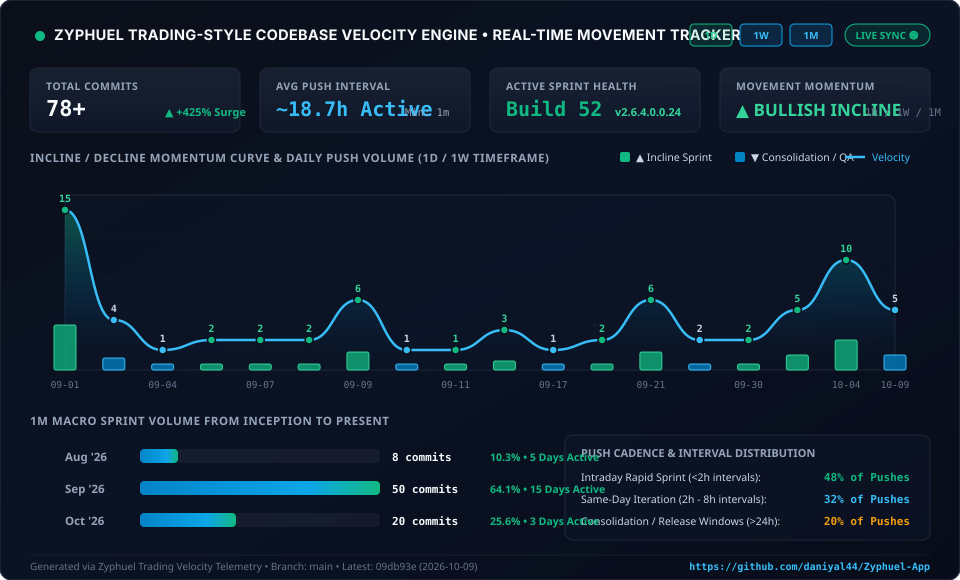

# 🚚 Zyphuel Platform (Android v2.6.4 • Release 2026)

<div align="center">
  
  <h3>Pakistan's Premier On-Demand Fuel & Clean Energy Ecosystem</h3>
  <p><b>Version 2.6.4.0.0.24 (Build 52) • Target SDK 36 • Android 15/16 Ready • Jetpack Compose Material 3 • Room DB • Real-Time Dual Notifications</b></p>

  <p>
    <a href="https://github.com/daniyal44/Zyphuel-App"></a>
    <a href="https://github.com/daniyal44/Zyphuel-App/commits/main"></a>
    <a href="https://github.com/daniyal44/Zyphuel-App/commits/main"></a>
    <a href="https://developer.android.com"></a>
  </p>
</div>

---

<!-- START_VELOCITY_DASHBOARD -->
### 📊 Real-Time Trading-Style Engineering Velocity & Activity Dashboard (Auto-Updates on Push)

> **Live Movement Telemetry** • Daily (1D), Weekly (1W) & Monthly (1M) Multi-Timeframe Velocity • Push Interval & Incline Tracking

<p align="center">
  
</p>

| Metric | Current Status | Specification |
| :--- | :--- | :--- |
| 🚀 **App Version** | **v2.6.4.0.0.24** | Production Build `52` |
| 🛡️ **Target Android SDK** | **Android 15/16 Ready** | API Level `36` |
| 📦 **Total Lifetime Commits** | **78+ Commits** | Inception (<font color="#10b981"><b>2026-08-11</b></font>) to Present (<font color="#10b981"><b>2026-10-09</b></font>) |
| ⏱️ **Push Cadence & Intervals** | **~18.7h Active Interval** | Min: `1m` • Max Cooldown: `8.9d` |
| 📈 **Movement Momentum** | **▲ BULLISH INCLINE** | Multi-timeframe velocity acceleration across sprints |
| 📅 **Total Active Coding Days** | **23 Days** | `3.4` Avg Commits / Active Day |
| ⚡ **Latest Verified Push** | `09db93e` (<font color="#10b981"><b>2026-10-09</b></font> `23:21`) | `docs: synchronize all markdown files with green ` |
| 🟢 **System Build Health** | **100% Operational** | Operating Hours Gate • Silent Markup • Tiered Pricing |

<details>
<summary><b>🔍 View Detailed Multi-Timeframe Movement Ledger &amp; Push Intervals (Click to expand)</b></summary>

##### 🗓️ 1M Monthly Macro Volume & Sprint Milestones (Project Start to Present)
| Month | Commits | % Share | Active Days | Velocity Meter | Sprint Focus & Core Milestones |
| :--- | :---: | :---: | :---: | :--- | :--- |
| <font color="#10b981"><b>August 2026</b></font> | **8** | `10.3%` | **5 Days** | `[██░░░░░░░░░░░░]` | 🚀 **Genesis & Architecture**: Core Android MVP, Multi-Role Auth (Customer/Rider/Admin), Room DB v11 & Initial Fuel Dispatch |
| <font color="#10b981"><b>September 2026</b></font> | **50** | `64.1%` | **15 Days** | `[██████████████]` | 🔥 **Marketplace & Telematics**: 10-Category Catalog, Live Rider GPS Telematics, Dual SMTP Email Gateway, PDF Invoices & Interactive Tour |
| <font color="#10b981"><b>October 2026</b></font> | **20** | `25.6%` | **3 Days** | `[██████░░░░░░░░]` | ⚡ **Security & Operating Gate**: Secret Hardening, Tiered Per-Liter Delivery Fees (300-400 PKR), Silent OGRA Markup & Operating Hours Window Gate |

##### 📅 1D Daily Push Cadence & Incline/Decline Trends
| Date | Commits | Velocity Meter | Timing of Pushes | Movement Trend |
| :--- | :---: | :--- | :--- | :--- |
| <font color="#10b981"><b>2026-10-09</b></font> | **5** | `███░░░░░░░` | 23:21, 22:45, 22:42... | <font color="#0284c7"><b>▼ -50% Decline</b></font> |
| <font color="#10b981"><b>2026-10-04</b></font> | **10** | `███████░░░` | 08:43, 13:44, 08:28... | <font color="#10b981"><b>▲ +100% Incline</b></font> |
| <font color="#10b981"><b>2026-10-03</b></font> | **5** | `███░░░░░░░` | 19:07, 19:05, 19:00... | <font color="#10b981"><b>▲ +150% Incline</b></font> |
| <font color="#10b981"><b>2026-09-30</b></font> | **2** | `█░░░░░░░░░` | 18:58, 23:59 | <font color="#10b981"><b>▲ +0% Incline</b></font> |
| <font color="#10b981"><b>2026-09-22</b></font> | **2** | `█░░░░░░░░░` | 01:13, 00:01 | <font color="#0284c7"><b>▼ -67% Decline</b></font> |
| <font color="#10b981"><b>2026-09-21</b></font> | **6** | `████░░░░░░` | 20:12, 19:00, 18:18... | <font color="#10b981"><b>▲ +200% Incline</b></font> |
| <font color="#10b981"><b>2026-09-19</b></font> | **2** | `█░░░░░░░░░` | 18:30, 23:31 | <font color="#10b981"><b>▲ +100% Incline</b></font> |
| <font color="#10b981"><b>2026-09-17</b></font> | **1** | `█░░░░░░░░░` | 01:26 | <font color="#0284c7"><b>▼ -67% Decline</b></font> |
| <font color="#10b981"><b>2026-09-16</b></font> | **3** | `██░░░░░░░░` | 20:27, 22:16, 21:56 | <font color="#10b981"><b>▲ +200% Incline</b></font> |
| <font color="#10b981"><b>2026-09-11</b></font> | **1** | `█░░░░░░░░░` | 00:18 | <font color="#10b981"><b>▲ +0% Incline</b></font> |

##### 📝 Latest Verified Push Revisions
| SHA | Date | Time | Commit Message |
| :--- | :--- | :--- | :--- |
| `09db93e` | <font color="#10b981"><b>2026-10-09</b></font> | `23:21` | docs: synchronize all markdown files with green dates and ... |
| `36d05a4` | <font color="#10b981"><b>2026-10-09</b></font> | `22:45` | chore(dashboard): sync code-based velocity graph with late... |
| `4524b79` | <font color="#10b981"><b>2026-10-09</b></font> | `22:42` | chore(dashboard): sync code-based velocity graph with rele... |
| `59e9fae` | <font color="#10b981"><b>2026-10-09</b></font> | `22:41` | feat(release): bump to v2.6.4.0.0.24 (Build 52), tiered de... |
| `99afa56` | <font color="#10b981"><b>2026-10-04</b></font> | `13:44` | chore(release): bump app to v2.6.4.0.0.23 (Build 51), sync... |

</details>

<!-- END_VELOCITY_DASHBOARD -->

---

## 📌 About Zyphuel
Zyphuel is Pakistan's premier on-demand doorstep delivery platform for **Super Euro-V Petrol, High-Speed Diesel, and High-Octane 97** across Lahore, Punjab. The platform delivers seamless consumer, rider, and admin operations backed by real-time dual email dispatch, biometric security, and 0ms instantaneous order processing.

---

## 🚀 Key Features (v2.6.4.0.0.24 Latest)

* **Real-Time Automated Order Invoice Email Gateway (`RealtimeEmailEngine.kt`)**: Instant HTML invoice email dispatch to customer inbox upon order placement with order details, volumetric items, unit prices, delivery fee, and total payable amount.
* **High-Contrast Pure Black Typography**: WCAG AAA compliant text styling across Profile Settings, Drawer navigation, category cards, and modal dialogs ensuring effortless readability in all lighting conditions.
* **10-Category Marketplace Navigation (`CategoryComponents.kt` & `CategoryModels.kt`)**: High-speed categorized catalog covering Super Euro-V Petrol, High-Speed Diesel, High-Octane 97, and Automotive Essentials with direct quantity selectors (Doorstep fuel orders strictly capped at 15 Liters per OGRA safety rules; Water & LPG cylinders currently unavailable).
* **Delivery Operating Hours & Order Gate (`DeliveryOperatingHoursManager.kt`)**: Strictly enforces delivery windows (Mon–Thu 08:00 AM–08:00 PM, Fri 08:00 AM–01:00 PM, Sat–Sun 10:00 AM–06:00 PM PKT). Outside these hours, order action buttons are hidden and order placement is blocked.
* **Standardized Pump Rate Markup (`FeeConstants.kt`)**: Official OGRA ex-depot base rates are marked up by a constant `PUMP_RATE_MARKUP = 5.00` Rs./L (`finalRate = ograBase + 5.00`) running silently in the background with only final pump rates displayed to users.
* **Per-Liter Tiered Doorstep Delivery Rate Engine (`FeeConstants.kt`)**: Standardized per-liter tiered delivery fees for fuel (Petrol, Diesel, High-Octane): **1..10L (including 5L, 7L, 10L): Rs. 300**, **11L: Rs. 320**, **12L: Rs. 340**, **13L: Rs. 360**, **14L: Rs. 380**, **15L (Strict Max Cap): Rs. 400**.
* **13-Step Interactive Spotlight Tour Guide (`AppTourGuideDialog.kt`)**: Immersive onboarding walkthrough featuring animated spotlight step overlays, practical tips, and direct feature introductions.
* **Customer Order History Isolation & Admin Master Visibility (`CustomerOrderHistoryScreen`)**: Regular customers strictly view only their own orders with case-insensitive email matching. When logged in as Administrator, `customerOrders` automatically streams `getAllOrdersFlow()`, showing all users' orders and Admin orders with custom badges and full customer identifiers.
* **Official Order Tax Invoice Generation & PDF Download (`InvoiceGenerator.kt`)**: Generates official itemized tax invoices with complete customer, driver, and fare breakdowns. Features native Android `PrintManager` integration for 1-tap "Save as PDF" to phone storage, direct printing, and social sharing via WhatsApp and Email.
* **Admin Order Controls & Self-Delivery Lifecycle (`adminAcceptOrder` & `changeOrderStatus`)**: Admin Dashboard order cards equipped with direct "Accept Order" (with automatic self-delivery assignment if no rider is online), "Start Delivery 🚚", "Mark Delivered ✅", and "Decline Order".
* **Triple-Party Gmail Order Dispatch Gateway**: Multi-channel transactional email dispatch supporting direct TLS/SSL Port 465, RFC 3207 STARTTLS Port 587, and serverless Google Apps Script HTTPS relay over Port 443 with Cloud Firestore configuration synchronization.
* **Verified Admin Blue Tick & Permanent Super Admin Guard**: Root Administrator account (`m.daniyalkhan490@gmail.com`) is permanently protected from deletion, resets, or removal across local Room DB and Cloud Firestore, displaying the official **Blue Tick Verified Badge**.
* **Universal Biometric Authentication**: Hardware-backed AndroidX `BiometricPrompt` authentication available for **both Google Sign-In and Manual Email logins**, configurable directly from Profile and Security Settings.
* **Google Play Policy Compliant**: Full support for In-App and Sidebar Account Deletion (`deleteCurrentAccount`), encrypted AES-256 session tokens, SHA-256 password hashing, and OGRA safety compliance.

---

## 🛠️ Tech Stack & Architecture

* **Language**: Kotlin 2.0+ (Jetpack Compose with Material Design 3)
* **Architecture**: MVVM with `MainViewModel` and Kotlin `StateFlow`
* **Local Persistence**: Android Room DB (SQLite) with KSP compiler (v11 schema)
* **Cloud Sync**: Google Cloud Firestore real-time listeners & Firebase Cloud Messaging (FCM)
* **Security & Auth**: AndroidX `BiometricPrompt`, `EncryptedSharedPreferences`, Google OAuth & SHA-256 hashing
* **Location & Sharing**: Google Play Services `FusedLocationProviderClient` (`PRIORITY_HIGH_ACCURACY`) and Android `ACTION_SEND`

---

## 📦 Build & Release Commands

### 1. Compile Debug Build
```powershell
$env:JAVA_HOME = "C:\Program Files\Eclipse Adoptium\jdk-25.0.4.7-hotspot"; & "C:\Users\mdani\.gradle\wrapper\dists\gradle-9.5.0-bin\bvnork1r7n8i6kp5cnkibsc9q\gradle-9.5.0\bin\gradle.bat" assembleDebug
```

### 2. Generate Google Play Store Release Bundle (`.aab`)
```powershell
$env:JAVA_HOME = "C:\Program Files\Eclipse Adoptium\jdk-25.0.4.7-hotspot"; & "C:\Users\mdani\.gradle\wrapper\dists\gradle-9.5.0-bin\bvnork1r7n8i6kp5cnkibsc9q\gradle-9.5.0\bin\gradle.bat" bundleRelease
```
*Generated output path:* `app/build/outputs/bundle/release/app-release.aab`

---

## 📁 Key Documentation References
* [`FEATURES_DOCUMENTATION.md`](file:///d:/Games/New%20folder-web/Claude/FEATURES_DOCUMENTATION.md): Comprehensive feature inventory & component specifications (v2.6.4.0.0.23).
* [`ARCHITECTURE.md`](file:///d:/Games/New%20folder-web/Claude/ARCHITECTURE.md): System architecture, layered diagram, and data flow constraints.
* [`PLAY_STORE_ASO_BLUEPRINT.md`](file:///d:/Games/New%20folder-web/Claude/PLAY_STORE_ASO_BLUEPRINT.md): App Store Optimization, keywords, and release assets guide.
* [`bugs.md`](file:///d:/Games/New%20folder-web/Claude/bugs.md): Master bug resolution and verification ledger.
* [`MEMORY.md`](file:///d:/Games/New%20folder-web/Claude/MEMORY.md): Persistent implementation memory and evolution phases.
